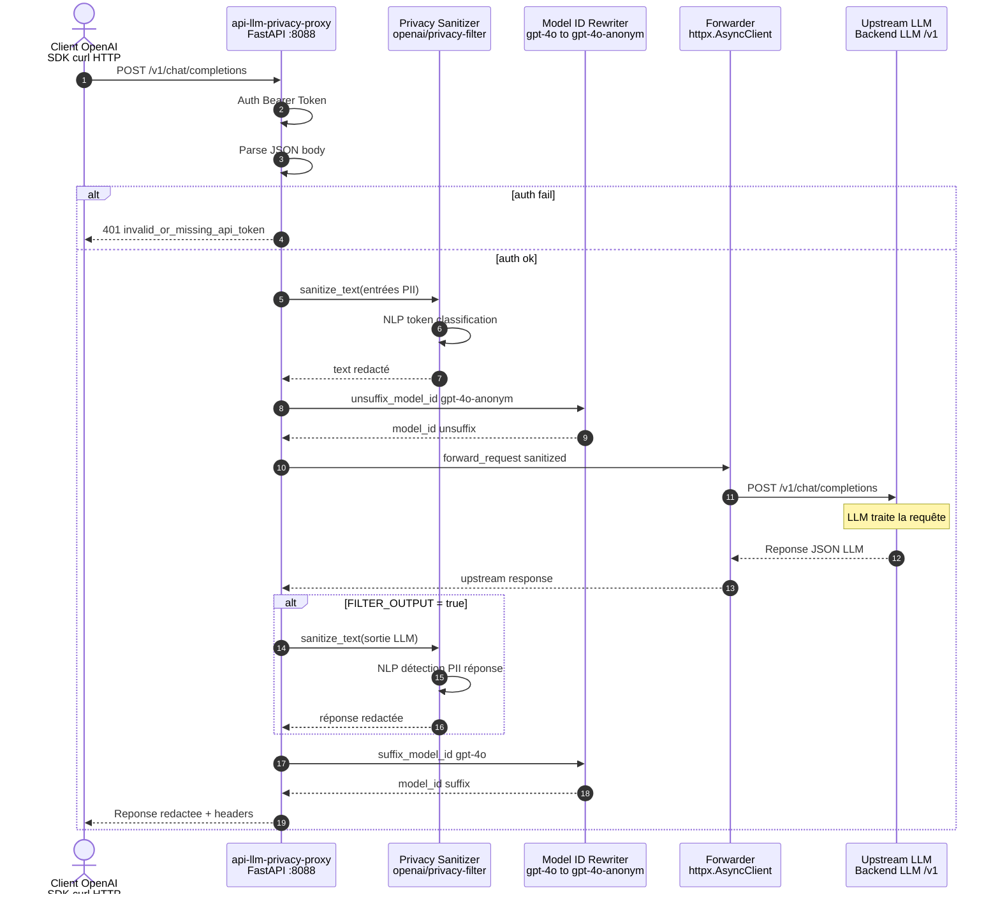
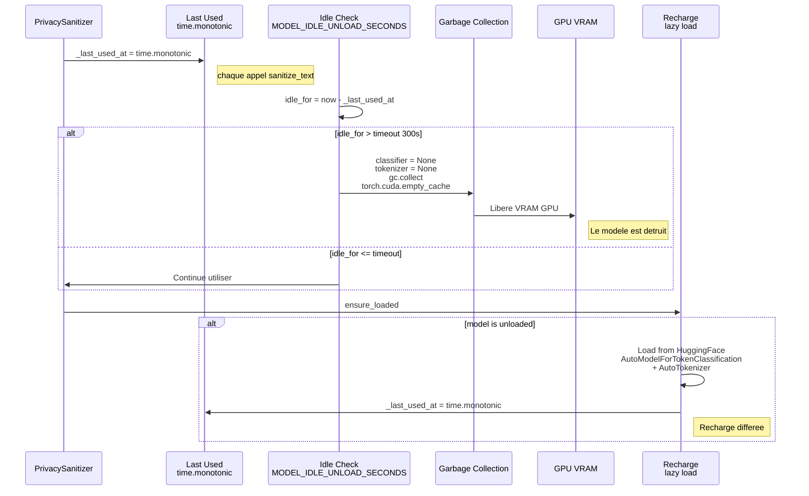

# API LLM Privacy Proxy — Architecture

Proxy OpenAI-compatible (`/v1/*`) qui filtre les PII avec `openai/privacy-filter`
avant transmission vers un backend LLM.

---

## Flux de requête

## Architecture des composants

```mermaid
graph LR
    Client[Client OpenAI<br/>SDK curl HTTP]
    AUTH[Auth N-Turn<br/>Bearer Token<br/>INBOUND_API_KEYS]
    SAN1[Sanitiser Entree<br/>PII detection]
    MODEL((openai/privacy-filter<br/>Token Classifier))
    RWIN[Rewriter Entrée<br/>unsuffix model ID]
    FWD[Forwarder<br/>httpx.AsyncClient]
    RWO[Rewriter Sortie<br/>suffix model ID]
    SAN2[Sanitiser Sortie<br/>PII reponse]
    METRICS[Metrics<br/>Prometheus]
    HEALTH[Health<br/>GET /health]
    REJECT[401 Unauthorized]
    LLM[Backend LLM<br/>v1-compatible]

    Client --> AUTH
    AUTH --> SAN1
    AUTH --> REJECT

    SAN1 --> MODEL
    MODEL --> RWIN
    RWIN --> FWD
    FWD --> LLM
    LLM --> FWD
    FWD --> RWO
    RWO --> SAN2
    SAN2 --> RWO
    RWO --> Client

    RWIN -.-> METRICS
    SAN2 -.-> METRICS
    AUTH -.-> METRICS
    HEALTH -.-> Client

    style Client fill:#0c3544,stroke:#22d3ee
    style AUTH fill:#881337,stroke:#fb7185
    style METRICS fill:#4c1d95,stroke:#a78bfa
    style LLM fill:#064e3b,stroke:#34d399
    style MODEL fill:#881337,stroke:#fb7185
    style REJECT fill:#1e293b,stroke:#fb7185
```

## Pipeline de redaction PII

```mermaid
graph TD
    A[JSON brut] --> B{Traversée<br/>récurseive JSON}
    B -->|clef skip| C[Pas filtre]
    B -->|string| D[Valeur string]
    B -->|dict| E{Enfant dict}
    B -->|list| F{Item liste}

    D --> G{Max chars<br/>atteint}
    G -->|oui| C
    G -->|non| H[Tokenisation]

    H --> I[NLP Inference<br/>token-classification]
    I --> J[Collecter spans<br/>score > threshold]

    J --> K{Spans<br/>vides}
    K -->|oui| C
    K -->|non| L[Merged spans<br/>fusionner overlaps]

    L --> M[Generer placeholders<br/>stable par requête]
    M --> N[Substituer spans<br/>PRIVATE_EMAIL_1]
    N --> O[Stats tokens/spans/labels]

    O --> P[JSON redacté]
    C --> P
    E --> B
    F --> B

    style A fill:#1e293b,stroke:#94a3b8
    style I fill:#881337,stroke:#fb7185
    style M fill:#881337,stroke:#fb7185
    style N fill:#881337,stroke:#fb7185
    style P fill:#34d399,stroke:#34d399
```

## Configuration

```mermaid
graph LR
    subgraph ENV[.env - Variables]
        V1[INBOUND_API_KEYS<br/>change-me]
        V2[UPSTREAM_BASE_URL<br/>http://127.0.0.1:8000/v1]
        V3[UPSTREAM_API_KEY<br/>cl-xxx]
        V4[PRIVACY_MODEL_ID<br/>openai/privacy-filter]
        V5[DEVICE<br/>auto cuda cpu]
        V6[TORCH_DTYPE<br/>auto fp32 fp16 bf16]
        V7[FILTER_OUTPUT<br/>true false]
        V8[MODEL_IDLE_UNLOAD_SECONDS<br/>300]
        V9[MIN_ENTITY_SCORE<br/>0.50]
        V10[MAX_STRING_CHARS<br/>200000]
        V11[MODEL_SUFFIX<br/>-anonym]
        V12[PLACEHOLDER_STYLE<br/>typed_index]
        V13[SKIP_JSON_KEYS<br/>model,role,type]
    end

    ENV --> SETTINGS[Settings dataclass Python]
    SETTINGS --> RUNTIME[Runtime FastAPI]

    style ENV fill:#78350f,stroke:#fbbf24
    style SETTINGS fill:#064e3b,stroke:#34d399
```

## Observabilite

```mermaid
graph LR
    subgraph METRIC[Metric Prometheus]
        M1[privacy_proxy_requests_total<br/>Total requetes]
        M2[privacy_proxy_filtered_requests_total<br/>Requetes avec PII]
        M3[privacy_proxy_filtered_tokens_total<br/>Tokens filtres]
        M4[privacy_proxy_filtered_spans_total<br/>PII spans]
        M5[privacy_proxy_filtered_spans_by_label<br/>PII par type]
    end

    subgraph HDR[Headers Reponse]
        H1[x-privacy-filtered-tokens]
        H2[x-privacy-filtered-spans]
        H3[x-privacy-filter-latency-ms]
    end

    subgraph EP[Endpoints]
        E1[GET /health<br/>Status OK + config]
        E2[GET /metrics<br/>Prometheus format]
        E3[OPTIONS /v1/*<br/>CORS preflight]
    end

    METRIC --> E2
    HDR --> E2
    METRIC --> E1
    EP --> E3

    style METRIC fill:#4c1d95,stroke:#a78bfa
    style HDR fill:#064e3b,stroke:#34d399
    style EP fill:#1e293b,stroke:#94a3b8
```

## Gestion memoire GPU Idle Unload

## Deploiement

```mermaid
graph TD
    subgraph PREP[Preparation]
        A[./install.sh<br/>uv venv + pip install]
        B[cp .env.example .env<br/>Configurer variables]
    end

    subgraph RUNTIME[Runtime]
        C[source run.sh 0.0.0.0 8088<br/>uvicorn app:app --port 8088]
    end

    subgraph PROD[Production]
        D[systemd service]
        E[sudo systemctl enable --now<br/>api-llm-privacy-proxy]
        F[journalctl -u<br/>api-llm-privacy-proxy -f]
    end

    A --> B
    B --> C
    C -->|developement| C
    C -->|systemd| D
    D --> E
    E --> F

    style PREP fill:#78350f,stroke:#fbbf24
    style RUNTIME fill:#064e3b,stroke:#34d399
    style PROD fill:#4c1d95,stroke:#a78bfa
```

## Exemple de redaction

| Entrée | Sortie |
|---|---|
| `Alice Smith, alice@example.com` | `[PRIVATE_PERSON_1], [PRIVATE_EMAIL_1]` |
| `+33 6 12 34 56 78` | `[PRIVATE_PHONE_NUMBER_1]` |
| `123 Main Street, Paris` | `[PRIVATE_ADDRESS_1]` |
| `1234567890` (SSN US) | `[PRIVATE_US_SSN_1]` |

Les placeholders sont stables : le même span PII détecté dans la même requête obtient toujours le même placeholder.

---

*API LLM Privacy Proxy • FastAPI + HuggingFace Transformers + PyTorch*
