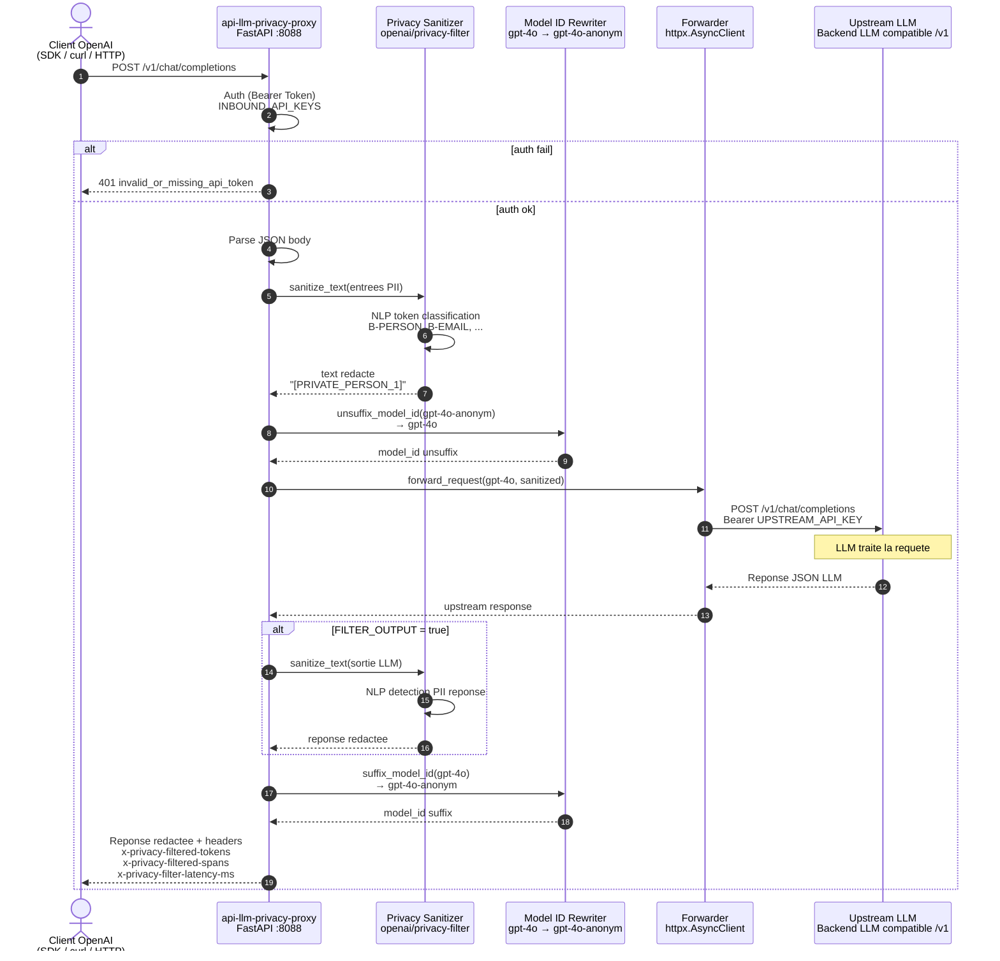
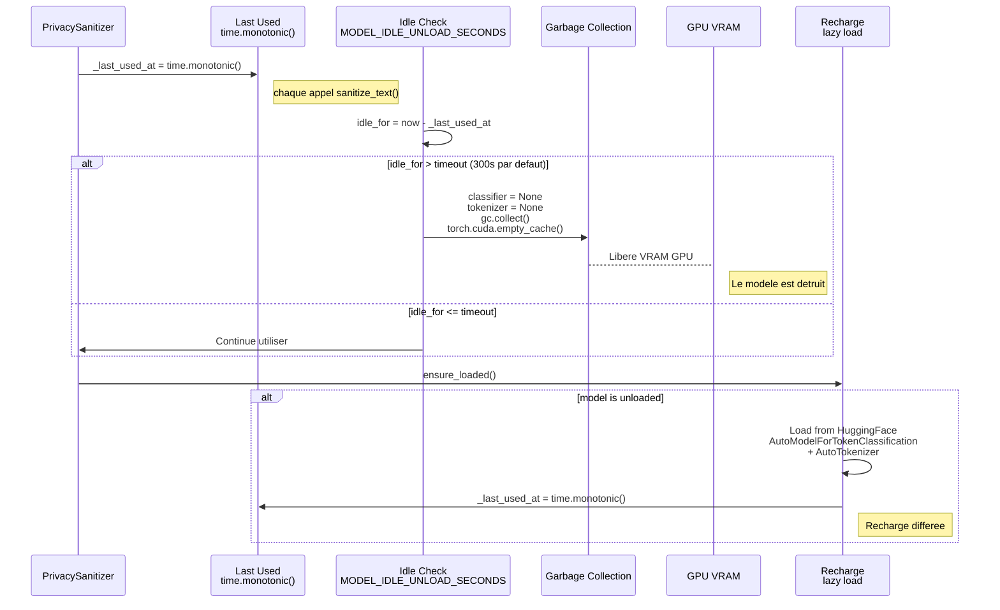

# API LLM Privacy Proxy — Architecture

Proxy OpenAI-compatible (`/v1/*`) qui filtre les PII avec `openai/privacy-filter`
avant transmission vers un backend LLM.

---

## Flux de requête



## Architecture des composants

```mermaid
graph LR
    subgraph EXTERNAL[Monde Externe]
        C[Client OpenAI<br/>SDK / curl / HTTP]
    end

    subgraph PROXY[api-llm-privacy-proxy — FastAPI :8088]
        AUTH[Auth N-Turn<br/>Bearer Token<br/>INBOUND_API_KEYS]
        
        subgraph SAN[Privacy Sanitizer]
            MODEL[(Privacy Model<br/>openai/privacy-filter)]
            TOKENIZER[Tokenizer<br/>transformers]
            NLP[NLP Pipeline<br/>Token Classification]
            REDACT[Redaction<br/>[PRIVATE_EMAIL_1]...]
        end

        REWRITE[Rewriter<br/>Model ID Suffix]
        FWD[Forwarder<br/>httpx.AsyncClient]
        STREAM[Streaming<br/>StreamingResponse]
        
        METRICS[Metrics<br/>Prometheus]
        HEALTH[Health<br/>GET /health]
    end

    subgraph UPSTREAM[Upstream LLM]
        LLM[Backend LLM<br/>v1-compatible]
    end

    C -->|POST /v1/*| AUTH
    AUTH -->|token ok| SAN
    AUTH -->|token fail| C2:[401]
    
    SAN -->|input| REDACT
    REDACT -->|spans| NLP
    NLP -->|tokens| MODEL
    MODEL -->|classification| REDACT
    
    REDACT -->|sanitized| REWRITE
    REWRITE -->|unsuffix| FWD
    
    FWD -->|POST upstream| LLM
    LLM -->|response| FWD
    
    FWD -->|JSON| REWRITE2[Output Rewrite<br/>suffix model id]
    REWRITE2 -->|FILTER_OUTPUT?| SAN2[Output Sanitize]
    SAN2 -->|yes| REDACT2
    SAN2 -->|no| END
    
    FWD -->|stream| STREAM
    STREAM --> C
    
    REDACT -.->|stats| METRICS
    REDACT2 -.->|stats| METRICS
    HEALTH -.->|status ok| C
    AUTH -.->|stats| METRICS

    style EXTERNAL fill:#1e293b,stroke:#94a3b8
    style PROXY fill:#334155,stroke:#cbd5e1
    style UPSTREAM fill:#14532d,stroke:#34d399
    style C fill:#0c3544,stroke:#22d3ee
    style AUTH fill:#881337,stroke:#fb7185
    style METRICS fill:#4c1d95,stroke:#a78bfa
    style LLM fill:#064e3b,stroke:#34d399
    style MODEL fill:#881337,stroke:#fb7185
```

## Pipeline de redaction PII

```mermaid
graph TD
    A[JSON brut] --> B{Traverse recursif JSON?}
    B -->|cle skip| C[Pas filtre]
    B -->|string value| D[Parse text]
    B -->|dict| E{Recursion children}
    B -->|list| F[Recursion items]
    
    D --> G{Max chars atteint?}
    G -->|yes| H[Retour non filtre]
    G -->|no| I[Tokenisation]
    
    I --> J[NLP Inference<br/>token-classification]
    J --> K[Collecter spans<br/>avec score > threshold]
    
    K --> L[Merged spans<br/>fusionner overlaps]
    L --> M[Generer placeholders<br/>stable par requete]
    M --> N[Substituer spans<br/>[PRIVATE_EMAIL_1]...]
    N --> O[Statistiques<br/>tokens/spans/labels]
    
    O --> P[JSON redacte]
    C --> P
    H --> P
    E --> B
    F --> B

    style A fill:#1e293b,stroke:#94a3b8
    style J fill:#881337,stroke:#fb7185
    style M fill:#881337,stroke:#fb7185
    style N fill:#881337,stroke:#fb7185
    style P fill:#34d399,stroke:#34d399
```

## Configuration

```mermaid
graph LR
    subgraph ENV[.env - Variables]
        INBOUND[INBOUND_API_KEYS<br/>change-me<br/>Tokens comma-separes]
        UPSTREAM[UPSTREAM_BASE_URL<br/>http://127.0.0.1:8000/v1<br/>Backend LLM]
        UPKEY[UPSTREAM_API_KEY<br/>cl-xxx<br/>Token upstream]
        MODEL[PRIVACY_MODEL_ID<br/>openai/privacy-filter<br/>Modele PII HuggingFace]
        DEVICE[DEVICE<br/>auto | cuda | cpu<br/>Dispositif inference]
        DTYPE[TORCH_DTYPE<br/>auto | fp32 | fp16 | bf16]
        FILTER[FILTER_OUTPUT<br/>true | false<br/>Filtrer reponses LLM]
        UNLOAD[MODEL_IDLE_UNLOAD_SECONDS<br/>300<br/>0 = jamais]
        SCORE[MIN_ENTITY_SCORE<br/>0.50<br/>Seuil detection PII]
        MAXSTR[MAX_STRING_CHARS<br/>200000<br/>Anti-abus par string]
        SUFFIX[MODEL_SUFFIX<br/>-anonym<br/>Suffix model id]
        PLACE[PLACEHOLDER_STYLE<br/>typed_index<br/>[PRIVATE_EMAIL_1]]
        SKIP[SKIP_JSON_KEYS<br/>model,role,type,...<br/>Cles a ignorer]
    end

    ENV --> SETTINGS[Settings - dataclass Python]
    SETTINGS --> RUNTIME[Runtime FastAPI]

    style ENV fill:#78350f,stroke:#fbbf24
    style SETTINGS fill:#064e3b,stroke:#34d399
```

## Observabilite

```mermaid
graph LR
    subgraph METRICS[Prometheus Metrics]
        M1[privacy_proxy_requests_total<br/>Total requetes proxiees]
        M2[privacy_proxy_filtered_requests_total<br/>Requetes avec au moins 1 PII]
        M3[privacy_proxy_filtered_tokens_total<br/>Tokens models filtres]
        M4[privacy_proxy_filtered_spans_total<br/>PII spans filtres]
        M5[privacy_proxy_filtered_spans_by_label_total<br/>PII par type<br/>{label=\"person\"}]
    end

    subgraph HEADERS[Headers Reponse]
        H1[x-privacy-filtered-tokens<br/>Tokens filtres entree]
        H2[x-privacy-filtered-spans<br/>PII spans detects]
        H3[x-privacy-filter-latency-ms<br/>Latence filtrage ms]
    end

    subgraph ENDPOINTS[Endpoints]
        E1[GET /health<br/>Status OK + config]
        E2[GET /metrics<br/>Prometheus format]
        E3[OPTIONS /v1/*<br/>CORS preflight]
    end

    METRICS --> E2
    HEADERS --> E2
    METRICS --> E1
    ENDPOINTS --> E3

    style METRICS fill:#4c1d95,stroke:#a78bfa
    style HEADERS fill:#064e3b,stroke:#34d399
    style ENDPOINTS fill:#1e293b,stroke:#94a3b8
```

## Gestion memoire GPU (Idle Unload)



## Deploiement

```mermaid
graph TD
    subgraph PREP[Preparation]
        I[./install.sh<br/>uv venv + pip install]
        I --> ENV2[cp .env.example .env<br/>Configurer variables]
    end

    subgraph RUNTIME[Runtime]
        R[source run.sh 0.0.0.0 8088<br/>uvicorn app:app --port 8088]
        ENV2 --> R
    end

    subgraph PROD[Production]
        SYS[systemd service]
        SYS2[sudo systemctl enable --now<br/>api-llm-privacy-proxy]
        LOG[journalctl -u<br/>api-llm-privacy-proxy -f]
    end

    R -->|developement| DEV
    R -->|systemd| SYS
    SYS --> SYS2
    SYS2 --> LOG

    style PREP fill:#78350f,stroke:#fbbf24
    style RUNTIME fill:#064e3b,stroke:#34d399
    style PROD fill:#4c1d95,stroke:#a78bfa
```



## Exemple de redaction

| Entrée | Sortie |
|---|---|
| `Alice Smith, alice@example.com` | `[PRIVATE_PERSON_1], [PRIVATE_EMAIL_1]` |
| `+33 6 12 34 56 78` | `[PRIVATE_PHONE_NUMBER_1]` |
| `123 Main Street, Paris` | `[PRIVATE_ADDRESS_1]` |
| `1234567890` (SSN US) | `[PRIVATE_US_SSN_1]` |

Les placeholders sont stables : le même span PII detecté dans la même requete obtient toujours le meme placeholder.

---

*API LLM Privacy Proxy • FastAPI + HuggingFace Transformers + PyTorch*
